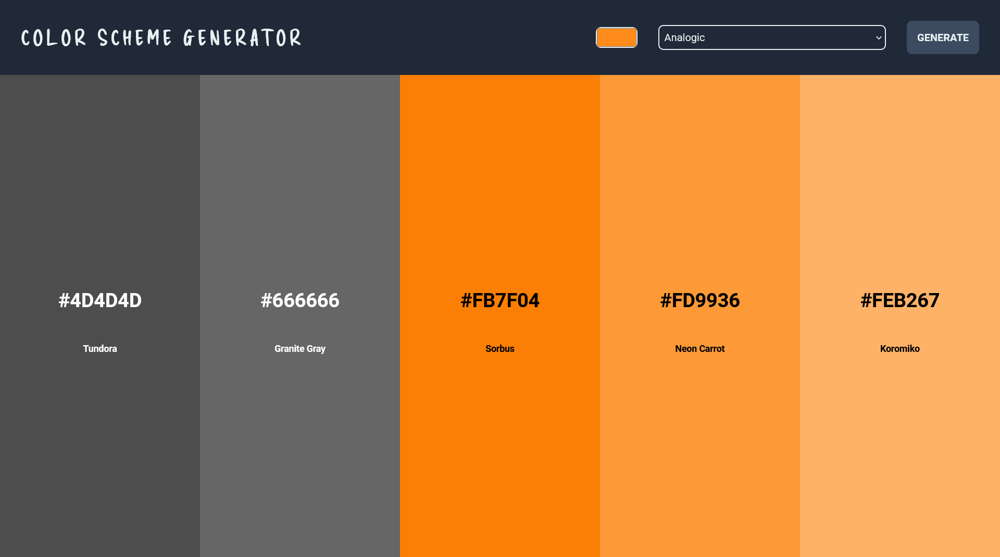

# Color Scheme Generator

    

<a href="https://noasalgado.github.io/Color-Scheme-Generator/">🔗 Live Demo </a>

## 🗒️ About The Project

This is a simple tool that allows to generate color schemes from the selected initial color.

The hexadecimal value of each color is displayed and the user can copy it to the clipboard.

## 🏗️ Built With

- HTML 5
- CSS
- JavaScript

## ⚙️ Resources Used

- [Google Fonts](https://fonts.google.com/knowledge) - Typography
- [The Color Api](https://fontawesome.com/) - API
